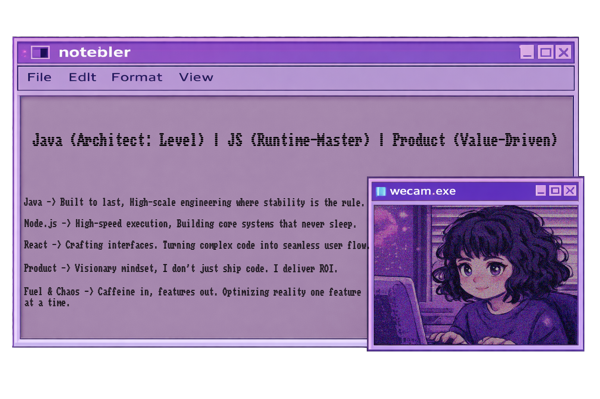

<!-- HEADER (Capsule) -->

  

 

## Tech Stack & Tools

<!-- FULL STACK (OPEN) - darkest -->
<!--

  

    
  

   

  

    
    
    
    
    
    
    
    
    
    
    
    
    
    
    
    
    
    
  

-->
<!-- BACKEND (CLOSED) - slightly lighter -->

  

    
  

  

    
    
    
    
    
    
    
    
    
  

<!-- FRONTEND (CLOSED) - brighter -->

  

    
  

  

    
    
    
    
    
    
    
    
  

<!-- EVERYTHING BELOW (CLOSED) - lightest -->

  

    
  

  

    
    
    
    
    
    
  

  

    
  

  

    
    
    
    
    
  

  

    
  

  

    
    
    
    
  

  

    
  

  

    
    
    
    
    
  

----------

## 👾 Let's Talk !

What I do ᕙ༼ ,,ԾܫԾ,, ༽ᕗ  ? 
 
- Full Stack Engineering: build, break, fix, ship
- Product mindset: problem → impact → metrics
 

  
  
  
  

## 🟪 **GitHub Analytics**

## 🟣 **LeetCode Statistics**

  
  

---

